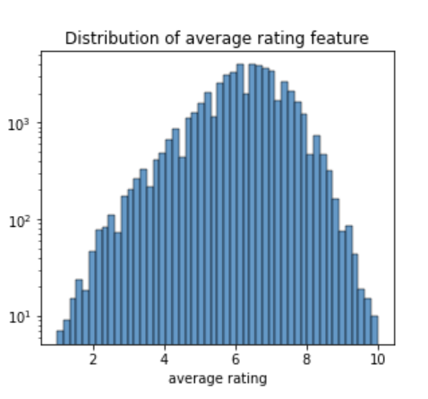
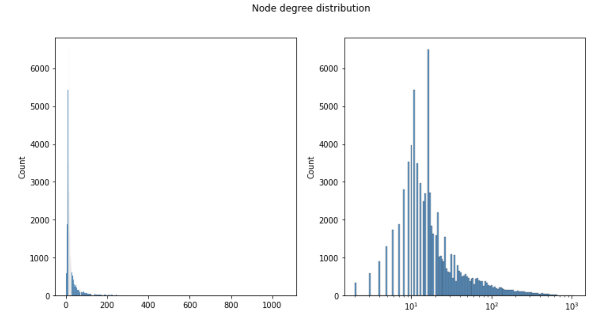
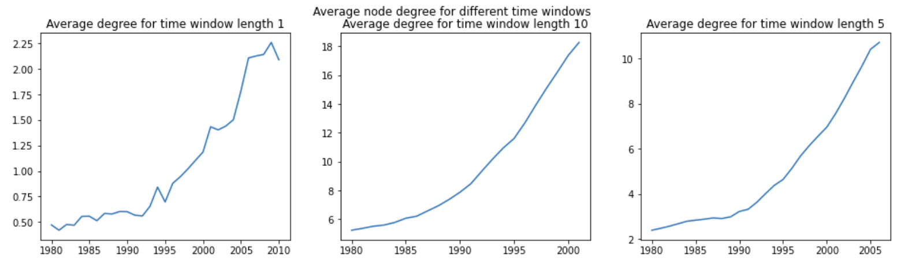

# Networking in the movie insustry : a key to success ?

  

## Study of the influence of actors network on their career evolution

How do actors become famous ? Is it only thanks to their skills ? Did their career explode once they played with an actor whose movies are already well recieved by the critics ? In this study, we aim to assess whether there is a link between an actor's network and his "score", where an actor score is characterized by the mean of the movie ratings he played in. For the purpose of our investigation, we construct a graph that can change over time, where nodes are actors and edges represent the fact that two actors play in a movie together. We study around 40 000 movies taken from [CMU Movie Summary Corpus](http://www.cs.cmu.edu/~ark/personas/), and use an additional dataset taken from [IMDb](https://datasets.imdbws.com/) in order to get the ratings of those movies. We study the actor's network evolution from 1980 to 2010, and analyze the interactions between the actors. 

### Why movie ratings as an actor's "success" scale ? 

We wanted to find a way to quantify how much an actor is successful in his carreer. We decided that a successful actor is an actor that plays in movies considered good by the public, which can be assessed thanks to the movie ratings. Then, an actor "success" is defined as the weighted average of their precedent movies, and the current one. Below, you can see the distribution of the movies rating, which looks like a normal distribution, centered in 6. 

  

### With how many actors do an actor play in average ? 

First, the graph of all the actors and movies have to be made. The graph is built from movies between 1980  and 2010. It is an undirected graph, since if one actor plays with another in a movie, it is always reciprocal.

| number of nodes | number of edges |  
|:----------------|:----------------|
|  75276          | 1225697         | 

The average node degree of our graph for the entire period is equal to $\frac{2E}{N} = \frac{2*75276}{1225697} = 32$. 

  

The node degree distribution is heavy tailed, with some actors that played with much more actors, so surely in much more movies than others.

But how does it change with the time window ? 

  

There are more oscillations for a time window of 1 year, which is normal, because an actor can play in a very different numbers of movies from on year to another. Furthermore, the average degree of actors is higher when the time window is higher, which is, again, as expected, because the actor will have more time to play in movies with other actors. Finally, the average node degree in increasing with time, (the average node degree is much higher in 2010 than in 1980). This may be due to the fact that we have more data in 2010 than in 1980, and to a higher number of movies created in the 2000s. We decided to keep a time window of 5, because there are less fluctuations than for 1 year, and less edges than for 10 years. 

(###  Who are those actors that have the most co-workers ? Are they good actors ?) 

### What is the proportion of "active" actors ? Are they better than "non-active" actors ?

We refer to an active actor an actor that has more than 100 edges, so that has played with more than 100 actors throughout his whole carrier. 

<iframe src="widget/file.html" width="400" height="300"></iframe>

ADD graph or histogram with the ~40 actors that have most edges. 

###  

This site was built using [this github repository](https://github.com/epfl-ada/ada-2022-project-datajugglers/tree/master)

