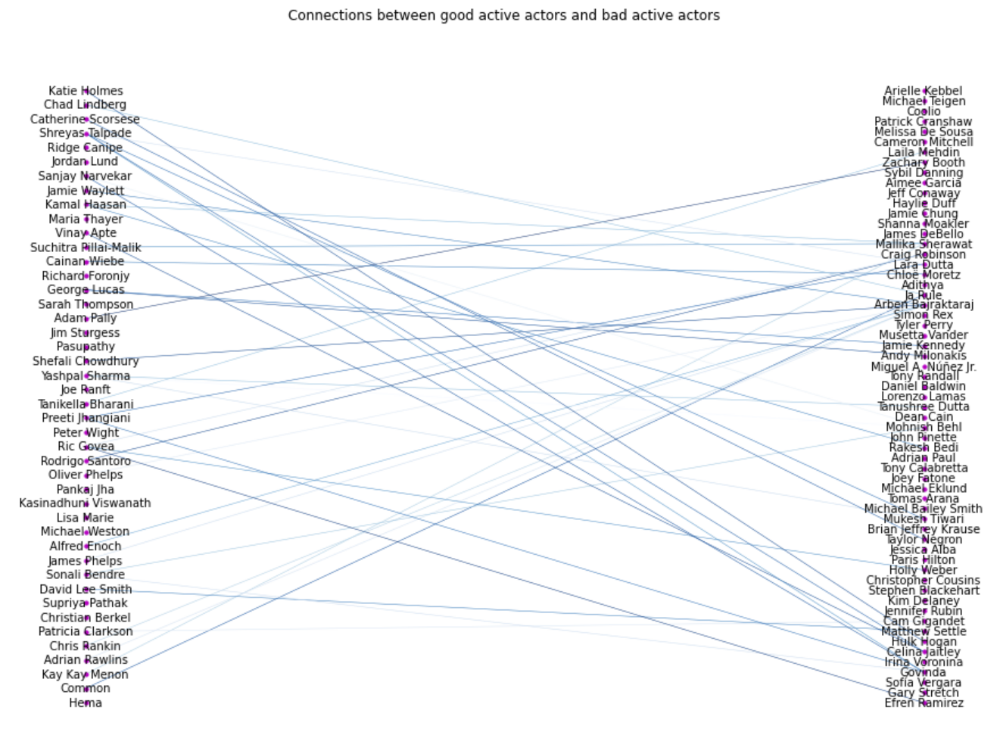
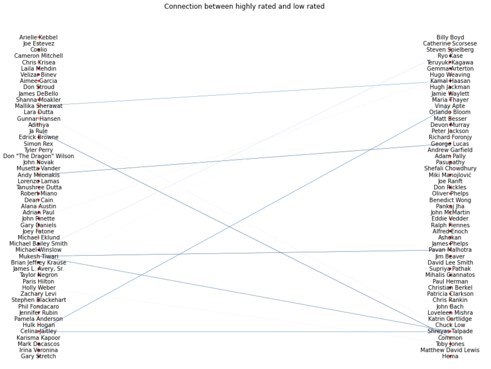
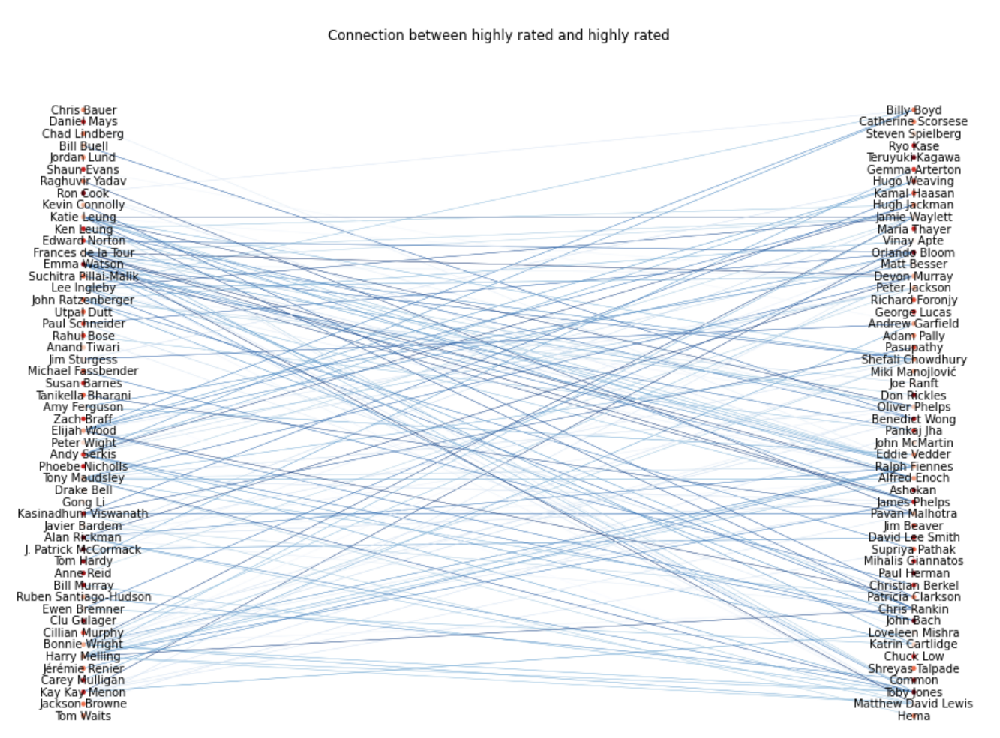

# Networking in the movie industry : a key to success ?

  

## Study of the influence of actors network on their career evolution

How do actors become famous ? Is it only thanks to their skills ? Did their career explode once they played with an actor whose movies are already well recieved by the critics ? In this study, we aim to assess whether there is a link between an actor's network and his "score", where an actor score is characterized by the mean of the movie ratings he played in. For the purpose of our investigation, we construct a graph that can change over time, where nodes are actors and edges represent the fact that two actors play in a movie together. We study around 40 000 movies taken from [CMU Movie Summary Corpus](http://www.cs.cmu.edu/~ark/personas/), and use an additional dataset taken from [IMDb](https://datasets.imdbws.com/) in order to get the ratings of those movies. We study the actor's network evolution from 1980 to 2010, and analyze the interactions between the actors. 

### Why movie ratings as an actor's "success" scale ? 

We wanted to find a way to quantify how much an actor is successful in his carreer. We decided that a successful actor is an actor that plays in movies considered good by the public, which can be assessed thanks to the movie ratings. Then, an actor "success" is defined as the weighted average of their precedent movies, and the current one. Below, you can see the distribution of the movies rating, which looks like a normal distribution, but little bit skewed toward 6. Our movies seem to be quite good in general (ratings majoritarely above 5).

  

### With how many actors do an actor play in average ? 

First, the graph of all the actors and movies have to be made. The graph is built from movies between 1980  and 2010. It is an undirected graph, since if one actor plays with another in a movie, it is always reciprocal.

| number of nodes | number of edges |  
|:----------------|:----------------|
|  75276          | 1225697         | 

The average node degree of our graph for the entire period is equal to $\frac{2E}{N} = \frac{2*75276}{1225697} = 32$. 

  

The node degree distribution is heavy tailed, with some actors that played with much more actors, so surely in much more movies than others.

But how does it change with the time window ? 

  

There are more oscillations for a time window of 1 year, which is normal, because an actor can play in a very different numbers of movies from on year to another. Furthermore, the average degree of actors is higher when the time window is higher, which is, again, as expected, because the actor will have more time to play in movies with other actors. Finally, the average node degree in increasing with time, (the average node degree is much higher in 2010 than in 1980). This may be due to the fact that we have more data in 2010 than in 1980, and to a higher number of movies created in the 2000s. We decided to keep a time window of 5, because there are less fluctuations than for 1 year, and less edges than for 10 years. 

### What is the proportion of "active" actors ? Are they mostly good actors ?

We refer to an active actor an actor that has more than 100 edges, so that has played with more than 100 actors throughout his/her carrier. Here, we can see that there are much less active actors than non-active ones. Then, we look into which actors have in general a better grade than their neighborhood (1 point more in average) and which have a lower one (0,5 below in average). They are refered as "good" or "bad" actors, because they are better or worse than their neighborhood.  In the active actors, the proportion of good ones is very low: it is not because you are more active that you will be successful (this can be explained easily by taking the example of one actor that plays in a lot of movies, but not qualitative ones).

<iframe src="widget/pie_chart.html" width="800" height="300"></iframe>

How does those percentages change if we look at the network over time ? Here, we investigated the changes of proportions through periods of 10 years. Throughout these periods, we can see that the proportion of good and bad actors is nearly equal (we have as much good as bad actors). The total proportion of out of the norm actors rises with time, starting from 21,33%, for the first 10 years, and going until 30,1% for the last ten years. We have to remind that the average degree, for a time window of 10, is also increasing a lot. Then, it could be linked : if one play in more movies, he has more chances to improve himself, or also distinct himself as a bad actor. It could also be that as we have more edges, actors can get more influenced by others, increasing the very good and very bad ones. 

<iframe src="widget/pie_chart_timedep.html" width="800" height="300"></iframe>

### Who are the most active actors ? 

We wanted to go deeper into the top 50 active actors. Who exactly are they? What is their final grade? The answer to this question is provided below. Looking at their ratings, we can observe that there is a wide range of colors and that not just actors with ratings above 6 are represented. It's tough to say anything about those performers' profiles based solely on their ratings. Furthermore, we can observe that those performers come from extremely various backgrounds, with some of them being blockbuster specialists like Bruce Willis or Samuel L. Jackson and others playing in minor roles or low-budget productions like Christopher McDonald. It is worth noting that the blockbuster actors have greater grades than the supporting actors. This could imply that being a main actor in a blockbuster demands a high grade, and so an actor's rating and prestige would influence his/her likelihood of playing in a blockbuster, but because we don't have information on those blockbusters it is difficult to make it a general case.
Still, we can plainly state that the number of edges in our network doesn't mean anything because the top 50 most active actors are too diverse to draw any conclusions other than that an actor who appears in a lot of movies is not necessarily a strong actor.

<iframe src="widget/50_Actors.html" width="800" height="300"></iframe>

###  Let's see if good and bad actors play together 

  

The expected number of edges between two random active actor groups is 70.27, which is greater than what we see here, which is just 40.
We can look at active actors with the highest average rating and active actors with the lowest average rating and count the number of edges between those two groups. We can also do the same thing with two distinct groups of actors with good ratings.

  

  

For the first Bipartite graph, only 12 connections can be seen. However, when looking at the connections between highly rated actors, we obtain 148 connections, which is also lots more than the edges between "normal" good and bad actors.
This suggests that successfull actors tend to play less with actors that have lower scores. Then, this can be difficult for an actor that starts to play in bad rated movies to rise up. We need to follow the carreer of the actors through time, and from the beginning, to see their starting point. But as an intermediate result we can say that good actors don't have the tendency to play with bad actors but in contrary they will mostly play with actors that also have a high rate.
### Is there an influence of the neighborhood on the actor's score ? 

This site was built using [this github repository](https://github.com/epfl-ada/ada-2022-project-datajugglers/tree/master)

